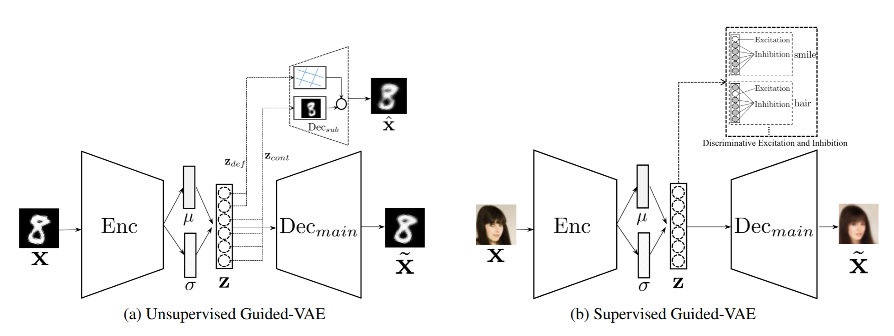

# Guided variational Autoencoder for Disentanglement Learning

Official Implementation for [Guided variational Autoencoder for Disentanglement Learning](https://arxiv.org/abs/2004.01255) (**CVPR2020**). This repo contains codes for the training and visualizing steps on MNIST and CelebA datasets in unsupervised way and supervised way respectively.




### Installation

1. Clone this repo:

```
git clone https://github.com/mlpc-ucsd/Guided-VAE.git
cd Guided-VAE
```

2. Set up a new conda environment and activate it.

```
conda create -n GuidedVAE python=3.8
conda activate GuidedVAE
```

3. Install pytorch environment.

```
conda install pytorch torchvision cudatoolkit=11.1 -c pytorch -c nvidia
conda install tqdm pillow
```

### Datasets Preparation

The structure of datasets should be

```
data_dir/
    celeba/
        images/
        list_attr_celeba.txt
    MNIST/
    	processed/
    	raw/
```

* For `MNIST`, `torchvision` will automatically download it.
* For `CelebA`, please refer to [the CelebA Dataset page](https://mmlab.ie.cuhk.edu.hk/projects/CelebA.html).

### Training and Visualizing

* For `MNIST`

```
python main.py --dataset MNIST --dataroot /path/to/your/data_dir --output output_MNIST
```

* For `CelebA`

```
python main.py --dataset CelebA --dataroot /path/to/your/data_dir --output output_CelebA
```

For more options, please refer to `main.py`.

### Citation

```
@inproceedings{ding2020guided,
  title={Guided variational autoencoder for disentanglement learning},
  author={Ding, Zheng and Xu, Yifan and Xu, Weijian and Parmar, Gaurav and Yang, Yang and Welling, Max and Tu, Zhuowen},
  booktitle={Proceedings of the IEEE/CVF Conference on Computer Vision and Pattern Recognition},
  pages={7920--7929},
  year={2020}
}
```

### License
This repository is released under the Apache License 2.0. License can be found in [LICENSE](LICENSE) file.
